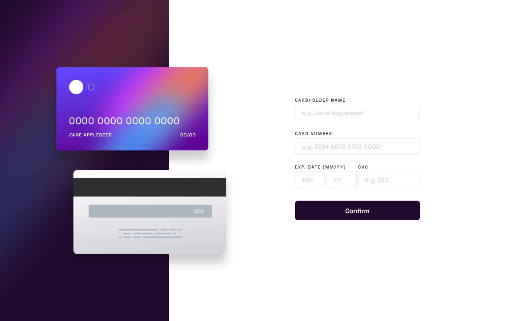

# Frontend Mentor - Interactive card details form solution

This is a solution to the [Interactive card details form challenge on Frontend Mentor](https://www.frontendmentor.io/challenges/interactive-card-details-form-XpS8cKZDWw). Frontend Mentor challenges help you improve your coding skills by building realistic projects.

## Table of contents

- [Overview](#overview)
  - [The challenge](#the-challenge)
  - [Screenshot](#screenshot)
  - [Links](#links)
- [My process](#my-process)
  - [Built with](#built-with)
  - [What I learned](#what-i-learned)
  - [Continued development](#continued-development)
- [Author](#author)

## Overview

### The challenge

Users should be able to:

- Fill in the form and see the card details update in real-time
- Receive error messages when the form is submitted if:
  - Any input field is empty
  - The card number, expiry date, or CVC fields are in the wrong format
- View the optimal layout depending on their device's screen size
- See hover, active, and focus states for interactive elements on the page

### Screenshot

### Links

- Solution URL: [GitHub repo](https://github.com/kemenyfa-szu/frontendmentor-027-creditcard/)
- Live Site URL: [GitHub Pages](https://kemenyfa-szu.github.io/frontendmentor-027-creditcard/)

## My process

### Built with

- Semantic HTML5 markup
- CSS custom properties
- Flexbox
- CSS Grid
- Mobile-first workflow
- [Angular](https://angular.io/) - JS framework

### What I learned

#### A LOT :D

- Reactive forms
- Input, Output decorators
- Receiving Input, emitting Output events
- FormControl validation
- Custom FormControl validator

### Continued development

- Make the card number input, to automatically place spaces after 4 digits, so the user does not have to type the spaces.

## Author

- Frontend Mentor - [@kemenyfa-szu](https://www.frontendmentor.io/profile/kemenyfa-szu)
